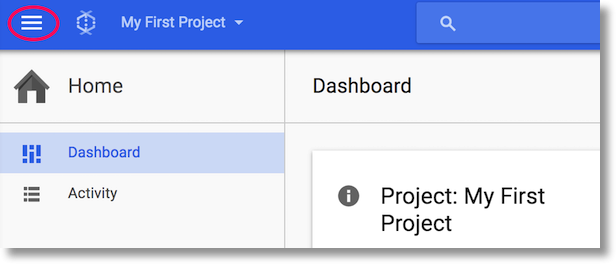
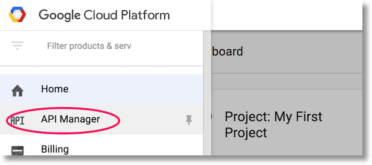

# TensorFlow on Cloud Machine Learning: Setup in a cloud-based environment

If you’re unfamiliar with Google Cloud Platform, and/or would rather do the exercises in this workshop in a cloud environment, follow these steps for initial setup.

Alternative setup flows for local installation can be found [here](INSTALL.md).

## Initial setup

### 1. Set Up Your GCP Project

#### 1.1 Create a Cloud Platform project

Create a Google Cloud Platform (GCP) account by [signing up for the free trial](https://cloud.google.com/free-trial/).
You will be asked to enter a credit card number, but you will get $300 of credits, and won't be billed.

If you already have an account, and have run through your trial credits, see one of the workshop instructors.

#### 1.2 Enable the necessary APIs

1. Click on the “hamburger” menu at upper-left, and then “API Manager”.
1. Click on “+ Enable API” (top-middle of page).
1. Enter “Compute Engine API” in the search box and click it when it appears in the list of results.
1. Click on “Enable” (top-middle of page).
1. Repeat steps 2 through 4 for: “Cloud Machine Learning” and “Dataflow”.






### 2. Connect to your project's Cloud Shell

Click on the Cloud Shell icon (leftmost icon in the set of icons at top-right of the page).


Run commands 3-6 below in the Cloud Shell.

### 3. Initialize Cloud ML for your project

```shell
gcloud beta ml init-project
```

### 4. Set up your Cloud Storage Bucket

```shell
PROJECT_ID=$(gcloud config list project --format "value(core.project)")
BUCKET_NAME=${PROJECT_ID}-ml
gsutil mb -l us-central1 gs://$BUCKET_NAME
```

### 5. Create a container-optimized image in GCE

```shell
gcloud compute instances create mlworkshop \
    --image-family gci-stable \
    --image-project google-containers \
    --zone us-central1-b --boot-disk-size=100GB \
    --machine-type n1-standard-1
```

### 6. Set up a firewall rule for your project that will allow access to the web services we will run

```shell
gcloud compute firewall-rules create mlworkshop --allow tcp:8888,tcp:6006,tcp:5000
```

### 7. SSH into the new GCE instance, in a new browser window

- Click on the “hamburger” menu at upper-left, and then “Compute Engine”
- Find your instance in the list (mid-page) and click on the “SSH” pulldown menu on the right. Select “Open in browser window”.
- A new browser window will open, with a command line into your GCE instance.

### 8. Start the Docker container in the GCE image (in the newly opened SSH browser window):

```shell
docker pull gcr.io/google-samples/tf-workshop:v5
mkdir workshop-data
docker run -v `pwd`/workshop-data:/root/tensorflow-workshop-master/workshop-data -it \
    -p 6006:6006 -p 8888:8888 -p 5000:5000 gcr.io/google-samples/tf-workshop:v5
```

Then, run the following in the Docker container.

### 9. Configure the Docker container. You’ll need your project ID for this step.

```shell
gcloud config set project <your-project-ID>
PROJECT_ID=$(gcloud config list project --format "value(core.project)")
BUCKET=gs://${PROJECT_ID}-ml
```

```shell
gcloud auth login
```
(and follow the subsequent instructions)

```shell
gcloud beta auth application-default login
```
(and follow the subsequent instructions)

### 10. Copy some data for the 'transfer learning' example to your bucket:

```shell
gsutil cp -r gs://tf-ml-workshop/transfer_learning/hugs_preproc_tfrecords $BUCKET
GCS_PATH=$BUCKET/hugs_preproc_tfrecords
```

## If you need to restart the container later

If you later exit your container and then want to restart it again, you can find the container ID by running the following in your VM:

```shell
docker ps -a
docker start <container_id>
```
Once the workshop container is running again, you can exec back into it like this:

```shell
docker exec -it <container_id> bash
```

## Cleanup

Once you’re done with your VM, you can stop or delete it. If you think you might return to it later, you might prefer to just stop it. (A stopped instance does not incur charges, but all of the resources that are attached to the instance will still be charged).  You can do this from the [cloud console](https://console.cloud.google.com), or via command line from the Cloud Shell as follows:

```shell
gcloud compute instances delete --zone us-central1-b mlworkshop
```
Or:

```shell
gcloud compute instances stop --zone us-central1-b mlworkshop
```
Then later:

```shell
gcloud compute instances start --zone us-central1-b mlworkshop
```
Delete the firewall rule as well:

```shell
gcloud compute firewall-rules delete mlworkshop
```
